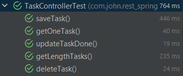

# Api Rest Springboot with send email with Attachment, documentation in Swagger and Unit Testing in junit

***
### MINI EXAMPLES FRAGMENTS CODE

> Task Controller
```java
@Operation(summary = "Update One Task")
    @ApiResponses(value = {
            @ApiResponse(responseCode = "200", description = "Task Done Changed Successfully",
                    content = { @Content(mediaType = "application/json",
                            schema = @Schema(implementation = Task.class)) }),
            @ApiResponse(responseCode = "404", description = "The Task Not exist or Not Found",
                    content = @Content) })
    @PutMapping("/tasks/{id}")
    public ResponseEntity<Task> updateTaskDone(@PathVariable Long id){
        Task task = taskRepository.findById(id)
                .orElseThrow(() -> new ResourceNotFoundException("The task not exists in the id " + id));
        task.setDone(!task.isDone());
        Task taskUpdated = taskRepository.save(task);

        return ResponseEntity.ok(task);
    }
```

> Other EndPoint
```java
@Operation(summary = "Get One Task")
    @ApiResponses(value = {
            @ApiResponse(responseCode = "200", description = "The Task Found Is",
                    content = { @Content(mediaType = "application/json",
                            schema = @Schema(implementation = Task.class)) }),
            @ApiResponse(responseCode = "500", description = "Internal Server Error",
                    content = @Content) })
    @GetMapping("/tasks/{id}")
    public Optional<Task> getOneTask(@PathVariable Long id){
        try{
            Optional<Task> taskFound = taskRepository.findById(id);
            return taskFound;
        }catch(Exception e){
            return Optional.empty();
        }
    }
```

## You can see the source code for send Email

>Unit testing
```java
@Test
void deleteTask() {
    Task testTask = new Task("Test 1", "some test description 1", false);
    taskRepository.save(testTask);
    taskRepository.deleteById(testTask.getId());
    //Search the Task Validating if yet exist
        Optional<Task> taskFound = taskRepository.findById(testTask.getId());
        assertEquals(Optional.empty(),taskFound);
    }
```

> Other test
```java
    boolean changeDoneTask (Long id){
        Task task = taskRepository.findById(id)
                .orElseThrow(() -> new ResourceNotFoundException("The task not exists in the id " + id));
        boolean stateStarted = task.isDone();
        task.setDone(!task.isDone());
        Task updatedTask = taskRepository.save(task);

        if(stateStarted != updatedTask.isDone()){
            return true;
        }else{
            return false;
        }
    }

    @Test
    void updateTaskDone() {
        Task testTask = new Task("Test 1", "some test description 1", false);
        taskRepository.save(testTask);
        assertTrue(changeDoneTask(testTask.getId()));
    }
```

>Result Of Tests
